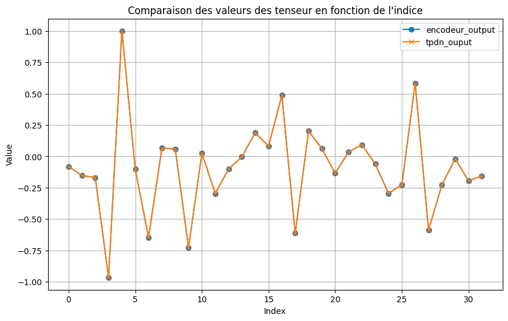

# Observation 

lorsque on entraîne les réseaux ( GRU et LSTM ) encodeur et décodeur avec une accuracy entre 70% et 80% (10 000 itérations) lors de l'entraînement : 
- malgré le fait le que le tpdn arrive à approximer d'une manière très précise les états cachés appris par l'encodeur, l'accuracy en validation reste extrêmement faible. Cela vient possiblement du fait que le décodeur bien qu'avec des performances correctes n'est pas parfait et commet tout de même des erreurs, ceci s'additionnant aux faibles erreurs d'encodage du tpdn peut potentiellement conduire à une très forte diminution des performances. Pour étudier cela il faudrait pousser l'entraînement du décodeur au maximum ( en complexifiant son architecture ou en augmentant le nombre d'itérations)
  - en augmentant le nombre d'itération lors du train du gru à 100000 on obtient une bien meilleure accuracy lors du train on obtiens une accuracy entre 97% et 100% mais les résultats avec le tpdn en encodeur restent toujours très décevant

### **un entraînement du tpdn à apprendre les états caché appris par l'encodeur**
Nous observons que le tpdn réussi parfaitement à apprendre les états caché ce qui est ce que nous recherchions néanmoins cela nous donne toujours une arrcuracy très faible en sortie du décodeur ... 

- Pour l'instant on utilise pas de dataset de train ou de test, on utilise juste une fonction qui génère de manière aléatoire peu être que faire des datasets serait intéressant. ( ca permettra au moins d'être reproducible)

### **Correction**

Après avoir changé le mode d'enregistrement des modèles ( torch.save au lieu de state_dict) nous réussissons à avoir des résultats satisfaisant en sortie du décodeur 

**ne plus utiliser** la fonction precision faite à la main if faut utiliser celle définit à partir de torchmetrics
